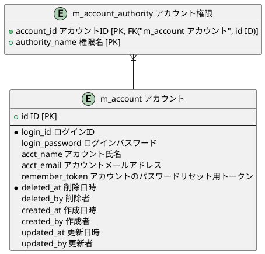

ドキュメント|ドキュメントID|表示グループ名    
------------|--------------|------------------
ER図        |ER-003        |ER図（アカウント）

# 概要

アカウント

```plantuml
@startuml 

entity "m_account アカウント" {
    + id ID [PK]
    ==
    * login_id ログインID
    login_password ログインパスワード
    acct_name アカウント氏名
    acct_email アカウントメールアドレス
    remember_token アカウントのパスワードリセット用トークン
    * deleted_at 削除日時
    deleted_by 削除者
    created_at 作成日時
    created_by 作成者
    updated_at 更新日時
    updated_by 更新者
}

entity "m_account_authority アカウント権限" {
    + account_id アカウントID [PK, FK("m_account アカウント", id ID)]
    + authority_name 権限名 [PK]
    ==
}

"m_account_authority アカウント権限" }|-- "m_account アカウント"
@enduml
```
