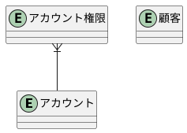

ドキュメント|ドキュメントID|表示グループ名
------------|--------------|--------------
ER図        |ER-001        |ER図（全体）  

システム全体のER図

```plantuml
@startuml 

entity "アカウント" {
}

entity "アカウント権限" {
}

entity "顧客" {
}

"アカウント権限" }|-- "アカウント"
@enduml
```
