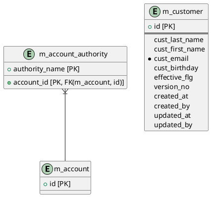

ドキュメント|ドキュメントID|表示グループ名
------------|--------------|--------------
ER図        |ER-002        |ER図（顧客）  

顧客を中心にしたER図

```plantuml
@startuml 

entity m_account {
    + id [PK]
}

entity m_account_authority {
    + account_id [PK, FK(m_account, id)]
    + authority_name [PK]
}

entity m_customer {
    + id [PK]
    ==
    cust_last_name
    cust_first_name
    * cust_email
    cust_birthday
    effective_flg
    version_no
    created_at
    created_by
    updated_at
    updated_by
}

m_account_authority }|-- m_account
@enduml
```
